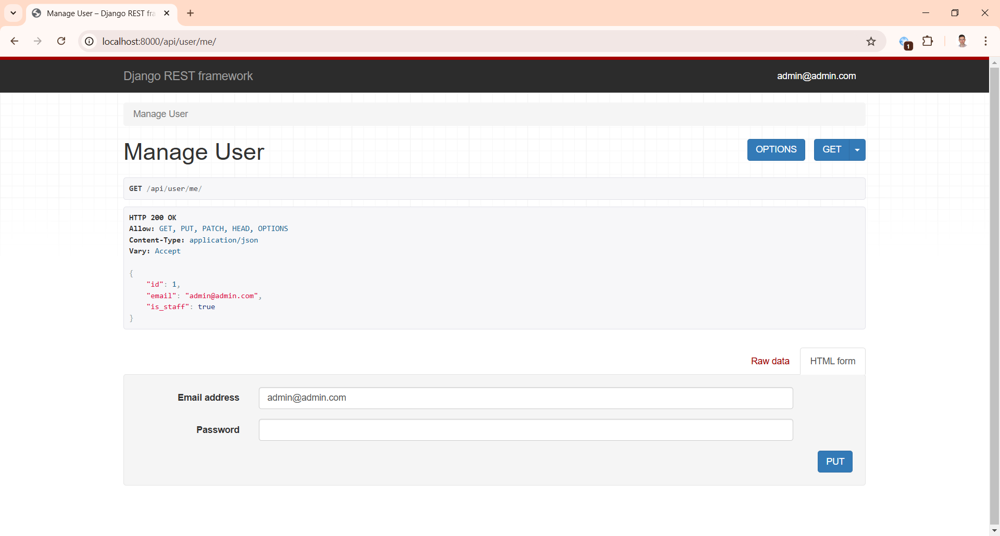
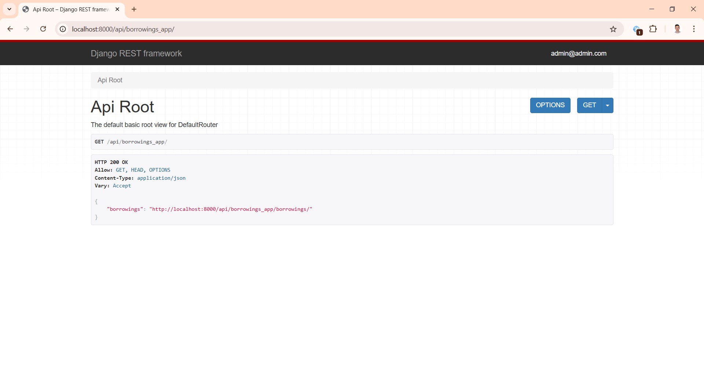

# Library service Project
<hr>

DRF project for library service

## Installation

Python 3 must be already installed

```commandline
git clone https://github.com/MaksymProtsak/library-service.git
cd library-service
python -m venv venv
venv\Scripts\activate
pip install -r requirements.txt
python manage.py runserver  # starts Django Server
```

## Run with docker
<hr>

```commandline
docker-compose build
docker-compose up
```

## Getting access
<hl>

* created user via /api/user/register/
* get access token via /api/user/token/
* refresh access token via /api/user/token/refresh/

## Features

* Authentication functionality for Customer/Admin
* Managing books and borrowings directly from website interface
* Powerful admin panel form advanced managing
* Documentation is located at api/doc/swagger/

## Crated admin (superuser) in docker container
1. Check running containers 
`docker-composer ps`
    ```
    NAME                                IMAGE                             COMMAND                  SERVICE           CREATED          STATUS          PORTS                 
    library-service-db-1                postgres:16.0-alpine3.17          "docker-entrypoint.s…"   db                36 seconds ago   Up 34 seconds   0.0.0.0:5432->5432/tcp
    library-service-library_service-1   library-service-library_service   "sh -c 'python manag…"   library_service   36 seconds ago   Up 34 seconds   0.0.0.0:8001->8000/tcp
    ```
2. Enter inside `library_service` container (the name from SERVICE column) with `sh` command.

    `library-service>docker-compose exec library_service sh`

3. Create superuser with `createsuperuser` command `python manage.py createsuperuser`.
4. Enter email and password of new superuser.

## Demo
Login user succeed 


User info page


Token refresh page


Books app routes


Books list


Book retrieve


Borrowing app routes


Borrowing list


Borrowing retrieve


Borrowing return


